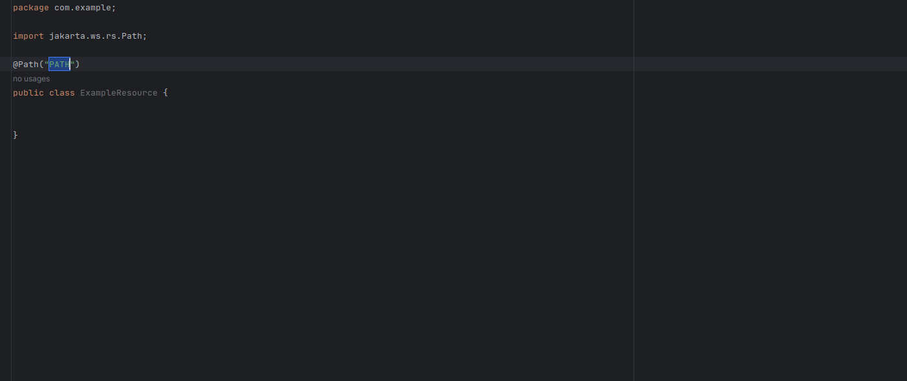

# About This Live Template

This is a set of live templates for Quarkus. This live templates help you to create Quarkus classes and methods faster.
You see the shortcuts below, I hope this live templates help you.

# Installation

Open your Intellij Idea configuration folder and go to ```config/templates``` folder. Then download
the ```quarkus.xml```
and copy this file to this folder.
My configuration folder is ```/home/mehmet/.config/JetBrains/IntelliJIdeaXXXX.X/templates/```.
This folder change for your OS. More information about this
folder [here](https://www.jetbrains.com/help/idea/sharing-live-templates.html#config-file-location).

# Shortcuts

| Shortcut |                    Description                     |                                                      Code                                                       |
|:--------:|:--------------------------------------------------:|:---------------------------------------------------------------------------------------------------------------:|
|   aps    |       Generate ApplicationScoped annotation        |                                            ```@ApplicationScoped```                                             |
|   sing   |           Generate Singleton annotation            |                                                ```@Singleton```                                                 |
|   dep    |           Generate Dependency annotation           |                                                ```@Dependent```                                                 |
|  resco   |         Generate RequestScoped annotation          |                                              ```@RequestScoped```                                               |
|   prov   |            Generate Provider annotation            |                                                 ```@Provider```                                                 |
| wsession |          Generate WithSession annotation           |                                               ```@WithSession```                                                |
|  regref  | Create RegisterForReflection annotation for class  |                                          ```@RegisterForReflection```                                           |
|   qpar   |           Generate QueryParam annotation           |                        ```@QueryParam("PARAMETER_NAME") PARAMETER_TYPE parameterName ```                        |
|   patp   |  Generate PathParam annotation for path variable   |                        ```@PathParam("PARAMETER_NAME") PARAMETER_TYPE parameterName ```                         |
|   inj    |             Generate Inject annotation             |                                                  ```@Inject```                                                  |
|  confp   |         Generate ConfigProperty annotation         |                   ```@ConfigProperty(name = "NAME", defaultValue="!") CONF_TYPE CONF_NAME;```                   |
|  loifp   |        Generate LookupIfProperty annotation        |                          ```@LookupIfProperty(name = "NAME", stringValue = "true")```                           |
|  postc   |         Generate PostConstruct annotation          |                                   ```@PostConstruct public void init() { }```                                   |
|   pred   |           Generate PreDestroy annotation           |                                   ```@PreDestroy public void destroy() { }```                                   |
|  logger  |            Create Quarkus Logger object            |                    ```private final Logger LOG = Logger.getLogger(ExampleResource.class);```                    |
|  rwgetm  |  Create reactive web get method for reactive web   |                           ```@GET @Path("PATH") public Uni<Response> getNAME() {}```                            |
| rwpostm  |  Create reactive web post method for reactive web  |            ```@POST @Path("/save/PATH") public Uni<Response> saveMETHOD_NAME(ENTITY  entity) { } ```            |
|  rwputm  |  Create reactive web put method for reactive web   | ```@PUT @Path("/update/{id}") public Uni<Response> updateNAME(@PathParam("id")ID_TYP id, ENTITY  entity) { }``` |
|  rwdelm  | Create reactive web delete method for reactive web |       ```@DELETE @Path("/delete/{id}") public Uni<Response> deleteNAME(@PathParam("id")ID_TYPE id) { }```       |
|  csjson  |    Create consume json method for reactive web     |                                   ```@Consumes(MediaType.APPLICATION_JSON)```                                   |
| prdjson  |    Create produce json method for reactive web     |                                   ```@Produces(MediaType.APPLICATION_JSON)```                                   |
| regresc  | Create RegisterRestClient annotation for interface |                                     ```@RegisterRestClient(baseUri = "")```                                     |
|   res    |             Create RestClient for code             |                                 ```@RestClient SampleService sampleService;```                                  |
| cliqpar  | Create ClientQueryParams annotation for interface  |                                 ```@ClientQueryParam(name = "", value = "")```                                  |
|  ronvt   |  Create RunOnVirtualThread annotation for method   |                                           ```@RunOnVirtualThread ```                                            |
|  nbloc   |      Create NonBlocking annotation for method      |                                               ```@NonBlocking```                                                |

# Live Template Usage Examples

[](quarkus_live_templates_usage.gif)